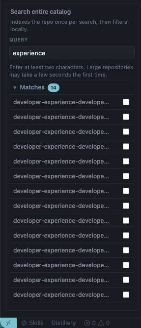
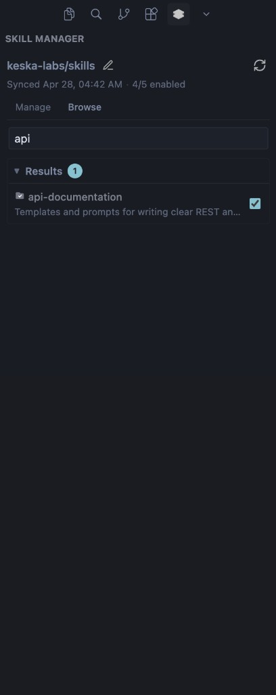
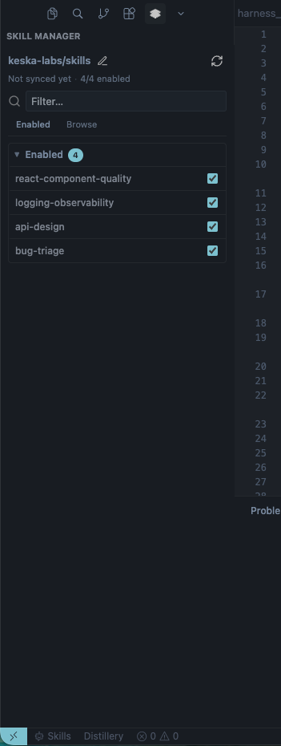
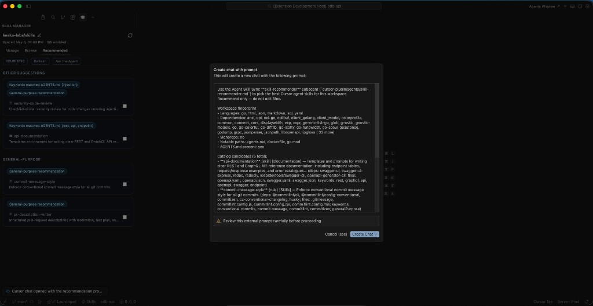

# Agent Skill Sync

Sync agent skills from **private or public GitHub repositories** or a **custom registry** into your workspace. Enabled items are written under **`.cursor/rules`** (single-file rules) and **`.cursor/skills`** (skill packages). The Skill Manager gives you progressive browse, catalog search, and one-click enable or disable.

Works with **VS Code 1.85+** and **Cursor**.

---

## Getting started

1. Install **Agent Skill Sync** from the marketplace (publisher **KeskaLabsAB**).
2. Open the **Skills** activity bar view (or use **Skill Sync: Manage AI Skills** from the Command Palette).
3. Sign in to GitHub when prompted if you use a private repository.
4. Choose your source: connect **`owner/repo`** for GitHub, or switch to custom registry mode and set the registry URL in settings.
5. On the **Manage** tab, turn on the skills you want. Use **Sync** or wait for background sync so files appear under `.cursor/rules` and `.cursor/skills`.

---

## Screenshots

### Browse repository tree



Browse folders on demand from GitHub without loading the full repository at once.
Inspect folder contents and enable skills.


### Full-text catalog search



Search by skill name, description, or category.

### Manage enabled skills



Filter enabled items and toggle skills on or off with one click.

### Recommended tab and Ask the Agent



The **Recommended** tab scores catalog skills against your workspace (LLM ranking when available, otherwise **HEURISTIC**). **Ask the Agent** prepares a detailed prompt—workspace fingerprint, catalog candidates, and skills you already enabled—and opens Cursor’s **Create chat with prompt** sheet so you can review it, then **Create Chat** to drop it into the agent composer (you can edit before sending). The same text is copied to the clipboard as a fallback. Works best with the bundled **skill-recommender** subagent ([`agents/skill-recommender.md`](./agents/skill-recommender.md), manifest [`.cursor-plugin/plugin.json`](./.cursor-plugin/plugin.json)).

---

## What you can do

- Connect a **private or public** GitHub repo that hosts Cursor rules and/or skill packages.
- Use **two kinds of content** in one repo:
  - **Cursor rules** — standalone `.mdc`, `.md`, `.yaml`, or `.yml` files (synced as rules under `.cursor/rules`).
  - **Skill packages** — a folder with a **`SKILL.md`** manifest ([agentskills.io](https://agentskills.io/specification) open standard); the whole folder syncs to `.cursor/skills/<name>/` when enabled.
- **Browse** the repo tree on demand without loading everything at once.
- **Search** the full catalog (name, description, category) after it is indexed.
- Use **Manage** to see what is enabled in this workspace and toggle skills quickly.
- Optionally use a **custom registry** with category-based listing.
- Sign in with GitHub for private repos (scopes include reading repositories you can access).

### AI-powered recommendations (Recommended tab)

- The **Recommended** tab ranks catalog skills against your workspace using trigger metadata and lightweight repo signals.
- With **`skillSync.recommendations.useLanguageModel`** enabled (default), it tries **VS Code’s Language Model API** (`vscode.lm`, e.g. Copilot), then optional keys for **Cursor SDK**, **OpenAI**, and **Anthropic** — configure keys via the Command Palette (`Skill Sync: Set … Recommendation Key`). Keys are stored in **Secret Storage**, not `settings.json`.
- If no provider is available, results fall back to **heuristic** ranking (badge in the UI). Use **Refresh** to bypass the TTL cache.
- **Ask the Agent** seeds Cursor chat via a [prompt deeplink](https://cursor.com/docs/reference/deeplinks): you confirm in **Create chat with prompt**, then the composer opens with context already filled (workspace languages/deps/paths, catalog list, opted-in skills). That keeps ranking inside Cursor without an API key when you use the **skill-recommender** subagent (`agents/skill-recommender.md`). Enable the plugin from this repo per [Cursor Plugins](https://cursor.com/docs/reference/plugins).
- After sync or browse, the extension writes **`.cursor/skill-sync/catalog.json`** (skill metadata only) so the subagent can read the live catalog.

#### Bundled Cursor plugin layout

Cursor expects the manifest at **`.cursor-plugin/plugin.json`** and agent files under **`agents/`** at the repository root ([plugin structure](https://cursor.com/docs/reference/plugins)). That is why there are two paths: the dot-folder is **only** for `plugin.json`; subagents live next to it in `agents/`, not inside `.cursor-plugin/`.

---

## How a GitHub skills repo is laid out

The extension looks for skills under the first folder that exists, in this order: **repository root** (for dedicated skills repos), then **`skills`**, **`.skills`**, **`rules`**, **`.cursor/rules`**.

Example:

```
your-skills-repo/
├── api-documentation/          ← skill package
│   ├── SKILL.md                ← required (see agentskills.io)
│   └── …
├── commit-message-style.mdc    ← Cursor rule
└── security-code-review.md     ← Cursor rule
```

**Skill packages** need a `SKILL.md` with YAML frontmatter, for example:

```markdown
---
name: api-documentation
description: Templates and prompts for clear REST API docs.
metadata:
  version: "1.0"
  category: Documentation
---

Instructions and links for the agent go here.
```

The `name` in the manifest should match the folder name (lowercase). Supporting files in that folder are included when the skill is enabled.

---

## Keyboard shortcut

| OS | Default |
| --- | --- |
| Windows / Linux | `Ctrl+Alt+S` |
| macOS | `Cmd+Alt+S` |

Focuses the Skill Manager sidebar. Change it under **Keyboard Shortcuts** — search for **Skill Sync: Focus Sidebar**.

---

## Settings

| Setting | Purpose |
| --- | --- |
| `skillSync.sourceMode` | `github-repo` (default) or `custom-registry` |
| `skillSync.sourceRepository` | GitHub repo as `owner/repo` |
| `skillSync.registryUrl` | Base URL when using a custom registry |
| `skillSync.categories` | Category names for registry mode |
| `skillSync.optedInSkills` | Names of skills currently enabled for sync |

Open **Settings** and search for **Agent Skill Sync** to edit these, or use **Preferences: Open User Settings (JSON)**.

---

## Privacy

GitHub calls use your signed-in account. Skill files are fetched only for skills you enable and are written under **`.cursor/rules`** and **`.cursor/skills`** in the current workspace. Nothing is uploaded for analytics by this extension. For GitHub’s own policies, see [GitHub documentation](https://docs.github.com/en/site-policy).

---

## License

MIT — see [LICENSE](./LICENSE).

**Publisher:** KeskaLabsAB · [Repository & issues](https://github.com/keska-labs/enterprise-skills) · [Sponsor](https://github.com/sponsors/keska-labs)
