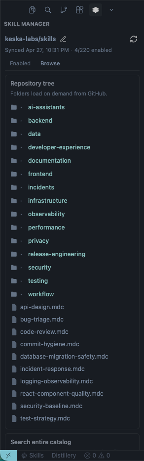

# Agent Skill Sync

Sync agent skill files from **private (and public) GitHub repositories** or a **custom registry** into your workspace under `.cursor/rules` — with a built-in browser, full-text catalog search, and one-click enable/disable.

> Works with VS Code 1.85+ and Cursor.

---

## Screenshots


*Browse the repository tree. Folders load on demand from GitHub.*


*Sync indicator with count of enabled skills.*


*Search the entire catalog — indexes once, filters locally.*


*Manage enabled skills with a filter and one-click toggle.*

---

## Features

- Connect a **private or public** GitHub repository that hosts `.cursor/rules` (or `skills` / `.skills`).
- Browse the repository tree progressively — folders load on demand.
- Full-text catalog search — indexes the repo once, then filters locally.
- Enable / disable skills per workspace with a single click.
- Optional **custom registry** mode with category-based listing.
- GitHub authentication via the built-in GitHub provider (`read:org`, `repo` for private repositories).
- Cached catalog metadata in global storage to keep the UI responsive.

---

## Keyboard shortcut

**Focus Skill Manager:**

| OS | Default |
| --- | --- |
| **Windows / Linux** | `Ctrl+Alt+S` |
| **macOS** | `Cmd+Alt+S` |

To change it: open **Keyboard Shortcuts** (`Ctrl+K Ctrl+S` / `Cmd+K Cmd+S`), search for **"Skill Sync: Focus Sidebar"**, and assign any chord you prefer.

---

## Configuration

| Key | Description |
| --- | --- |
| `skillSync.sourceMode` | `github-repo` (default) or `custom-registry` |
| `skillSync.sourceRepository` | `owner/repo` for GitHub sources |
| `skillSync.registryUrl` | Base URL for a custom registry |
| `skillSync.categories` | Category names for the registry |
| `skillSync.optedInSkills` | Skill names currently enabled for sync |

---

## Privacy

GitHub API calls use your signed-in session token. Skill content is fetched only for skills you enable and written under `.cursor/rules` in the current workspace. Nothing leaves VS Code without an explicit sync. See [GitHub's terms](https://docs.github.com/en/site-policy) for API use.

---

## Development

```bash
npm ci
npm run lint
npm test
npm run build
```

Source lives under `src/` (extension host) and `webview-ui/` (React sidebar). The packaged extension loads `dist/extension.js` and `dist/webview.js`.

### Packaging a `.vsix`

```bash
npm ci
npm run vsix          # lint → test → production build → vsce package
```

Produces `agent-skill-sync-<version>.vsix` at the repo root (gitignored).

### Publishing to the Visual Studio Marketplace

**Manual upload** (no PAT needed):

1. Sign in at [marketplace.visualstudio.com/manage](https://marketplace.visualstudio.com/manage) — publisher **`KeskaLabsAB`**.
2. **Extensions → Update** → choose the `.vsix`.

**CI release** — push a `v*` tag; the [Release workflow](.github/workflows/release.yml) runs the same gates and attaches the `.vsix` to a GitHub Release automatically.

Always bump **`version`** in `package.json` before tagging so the package name, tag, and Marketplace version stay in sync.

---

## License

MIT — see [LICENSE](./LICENSE).  
Publisher: **KeskaLabsAB** · [Source & issues](https://github.com/keska-labs/enterprise-skills) · [Sponsor](https://github.com/sponsors/keska-labs)
